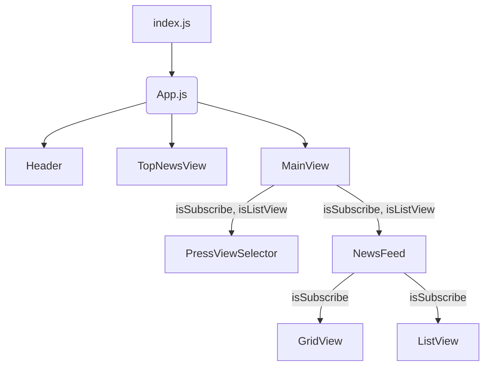

# 기능 요구 사항
## 상단 영역
 - [X] 상단 왼쪽에는 로고를, 오른쪽에는 시트템 날짜를 표시한다.
 - [X] 뉴스스텐드 로고를 클릭하면 화면을 새로고침 한다.

## 중간 영역(최신 뉴스 자동롤링 영역)
 - [X] 왼쪽 바와 오른쪽 바는 각각 다른 최신 뉴스의 헤드라인 5개가 5초마다 자동으로 무한 롤링 되도록 한다.
 - [X] 좌우 영역의 시간차를 1초로 하여 두 영역의 뉴스가 동시에 롤링 되지 않도록 한다.
 - [X] 각 영역에 마우스를 호버하면, 무한 롤링을 일시정지하고, 헤드라인에 밑줄을 표시한다.

## 하단 영역([전체 언론사] 탭의 [그리드 보기] 기본 상태)
### 전체 언론사
#### [그리드 보기]
 - [X] 가로 930px, 세로 388px의 영역에 6*4 데이블이 들어가도록 한다.
 - [X] 각 테이블의 셀에는 언론사 브랜드 마크가 중앙에 배치하도록 한다.
 - [X] 언론사 브랜드 마크의 순서는 페이지가 새로고침 될 때마다 랜덤으로 배치되도록 한다.
 - [X] 좌우에는 화살표를 배치하여 페이지를 넘길 수 있도록 한다.
 - [X] 가장 첫 페이지와 가장 끝 페이지에서 Disabled되는 화살표는 아예 표시하지 않도록 한다.
 - [X] 언론사는 아무리 많아도 4페이지까지만 표시한다.
 - [X] 각 언론사 브랜드마크가 있는 셀에 마우스를 올리면, [구독하기] 버튼이 보이도록 한다.
 - [X] 이미 구독하고 있는 언론사의 경우, [해지하기] 버튼이 보이도록 한다.
 
#### [리스트 보기]
 - [X] 각 분야 카테고리에서 언론사의 기사를 확인할 수 있도록 한다.
   - 종합/경제
   - 방송/통신
   - IT
   - 영자지
   - 스포츠/연애
   - 매거진/전문지
   - 지역
 - [X] 선택된 카테고리의 이름 옆에는 해당 카테고리에 속해있는 언론사의 갯수와 현재 언론사의 순서를 표시한다.
 - [X] 언론사의 순서는 새로고침 될 때마다 랜덤으로 정해지도록 한다.
 - [X] 현재 언론사 내용을 표시한다.
 - [X] 한 언론사당 20초 간 화면에 보여지도록 하는데, 카테고리명 배경이 프로그래스바가 되어 초마다 색이 차오르도록 애니메이션을 적용한다.
 - [X] 20초가 되면 다음 언론사의 내용이 나타나도록 한다.
 - [X] 카테고리 마지막 언론사가 20초간 보여진 후에는, 다음 카테고리로 넘어가도록 한다.
 - [X] 가장 마지막 카테고리의 마지막 언론사가 보여진 후에는, 처음 카테고리의 첫 언론사로 돌아오도록 한다.
 - [X] 좌우 화살표를 통해서도 즉시 이전과 다음 뉴스로 넘어갈 수 있다.
 - [X] 선택된 카테고리외의 다른 카테고리에는 마우스를 올리면 밑줄이 생긴다.
 - [X] 각 카테고리를 누르면 해당 카테고리로 바로 이동한다.
 - [ ] 메인 뉴스에 마우스를 올리면 썸네일은 5%확대되고, 뉴스 타이틀에는 밑줄이 생기도록 한다.
 - [ ] [구독하기] 버튼을 누르면, "내가 구독한 언론사에 추가되었습니다."라는 스낵바가 5초간 유지된 후, 즉시 내가 구독한 언론사 탭의 리스트 보기 화면으로 이동한다.
 
 ### 내가 구독한 언론사
 #### [리스트 보기]
  - [ ] 전체 언론사의 리스트보기와 동일하되, 카테고리의 가로 탭에 언론사 이름과 -> 화살표 아이콘이 보이도록 한다.
  - [ ] 구독한 언론사가 많아 탭의 가로 영역을 넘어가는 경우, 드래그를 통해 가로로 스크롤이 되도록 한다.
  - [ ] 언론사는 구독한 순서대로 배치
  - [ ] 내가 구독한 언론사 탭 상태에서는 리스트 보기가 기본이다.
  - [ ] [구독해지] 버튼을 누르면 "(언론사 이름)을 구독해지하시겠습니까?" 라는 알럿이 뜨도록 한다.
    - [ ] 예, 해지합니다, 아니요
  - [ ] 각 버튼에 마우스를 올리면 텍스트에 밑줄이 생기도록 한다.
  - [ ] 예, 해지합니다 를 선택하면 즉시 구독이 해지되고, 목록의 다음 순서 언론사가 바로 나타나도록 한다.
#### [그리드 보기]
 - [ ] 전체 언론사의 그리드 보기 화면과 동일
 - [ ] 사용자가 구독한 언론사의 브랜드 마크만 보이고, 나머지 칸은 비어있도록 한다.
 - [ ] 구독중인 언론사의 브랜드마크 셀에 마우스를 올리면 [구독해지] 버튼이 나타난다.
 - [ ] 구독해지 버튼을 누르면 알럿이 뜨도록 한다.
 - [ ] 구독이 해지되는 즉시 그리드에서 해당 언론사의 브랜드마크가 사라지도록 한다.
  
### 추가 미션: 다크모드
---

## Sequence diagram

